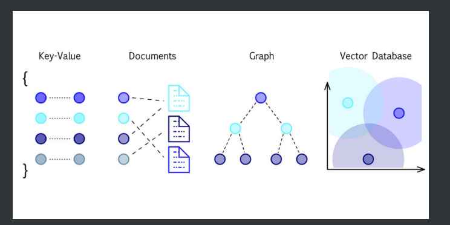
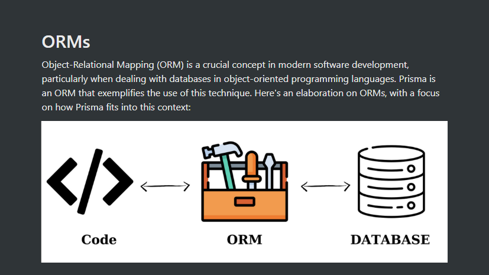

# Backend databases
NOSQL - schema-less fashion ,extremely lean and fast way to store data
Graph databases
Data is stored in the form of a graph. Specially useful in cases where relationships need to be stored (social networks
Examples - Neo4j
 
SQL- stoers data in forms of rows and tables

> 💡
You might think that mongoose does add strictness to the codebase because we used to define a schema there.
That strictness is present at the Node.js level, not at the DB level. You can still put in erroneous data in the database that doesn’t follow that schema.

Why not NOSQL - it can get corruptes easily ,no strictness prestnt at DB level

Why SQL
SQL databases have a strict schema. They require you to
Define your schema
Put in data that follows that schema
Update the schema as your app changes and perform migrations 
migrations -means you tell the DB to add/remove an column or make changes to suit future requests


``    FOREIGN KEY (user_id) REFERENCES users(id) ON DELETE CASCADE ``
userId is a foreigh  key references users{a table} on delete cascade-means delte the rows dependant on a 
particular usetr id oif tht user id is deleted

Why we need transactions - 

Good question to have at this point is what queries are run when the user signs up and sends both their information and their address in a single request.
Do we send two SQL queries into the database? What if one of the queries (address query for example) fails?
This would require transactions  in SQL to ensure either both the user information and address goes in, or neither does

```angular2html
BEGIN; -- Start transaction

INSERT INTO users (username, email, password)
VALUES ('john_doe', 'john_doe1@example.com', 'securepassword123');

INSERT INTO addresses (user_id, city, country, street, pincode)
VALUES (currval('users_id_seq'), 'New York', 'USA', '123 Broadway St', '10001');

COMMIT;
```


# Joins
1. INNER JOIN
   Returns rows when there is at least one match in both tables. If there is no match, the rows are not returned. It's the most common type of join.
   Use Case: Find All Users With Their Addresses. If a user hasn’t filled their address, that user shouldn’t be returned
2.  LEFT JOIN
    Returns all rows from the left table, and the matched rows from the right table.
    Use case - To list all users from your database along with their address information (if they've provided it), you'd use a LEFT JOIN. Users without an address will still appear in your query result, but the address fields will be NULL for them.
3. RIGHT JOIN
   Returns all rows from the right table, and the matched rows from the left table.
   Use case - Given the structure of the database, a RIGHT JOIN would be less common since the addresses table is unlikely to have entries not linked to a user due to the foreign key constraint. However, if you had a situation where you start with the addresses table and optionally include user information, this would be the theoretical use case
4. FULL JOIN
   Returns rows when there is a match in one of the tables. It effectively combines the results of both LEFT JOIN and RIGHT JOIN.
   Use case - A FULL JOIN would combine all records from both users and addresses, showing the relationship where it exists. Given the constraints, this might not be as relevant because every address should be linked to a user, but if there were somehow orphaned records on either side, this query would reveal them.

What is a client - Prisma creates files/codes/clients that reads from schema.prisma and make imports ready for index.ts files to import and use them in backend
acc to the tables ,prisma generatres clients


