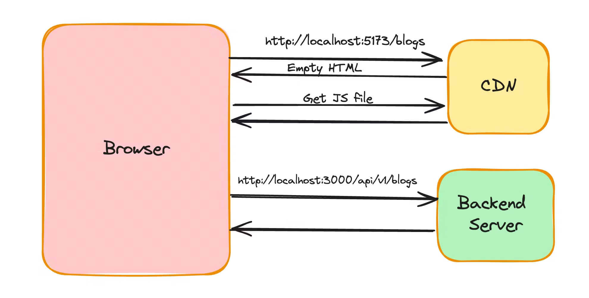
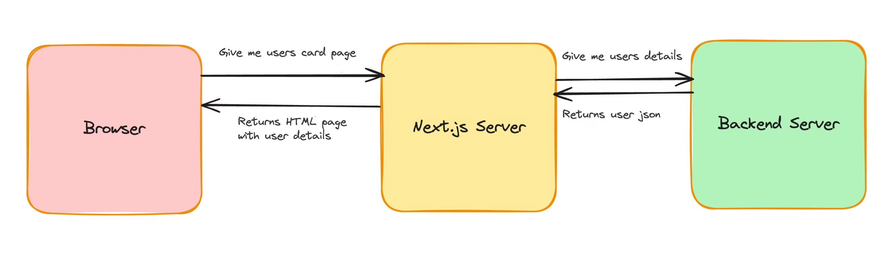
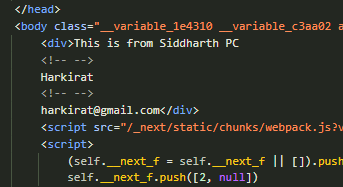

# NextJS

this is what happens when you code REact for frontend and post it in CDN and backend express/NodeJS in EC2 or GCP

in Next.js you can do both in one place 

nextjs has an asynchrnous components , only on server  components

Server side rendered HTML

The Waterfall problem in Next.js refers to inefficient data fetching or rendering, where multiple asynchronous operations (like API calls or database queries) are executed sequentially, causing delays. This happens when one operation waits for the previous one to complete, even though they could potentially run in parallel.
layout ,pages are opiniated by nextjs team