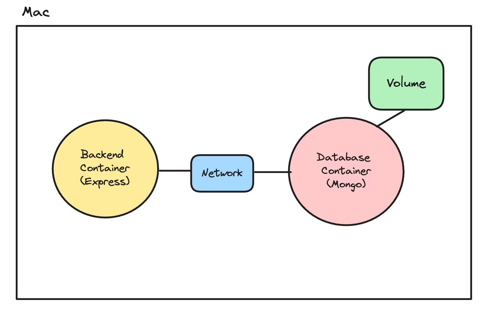
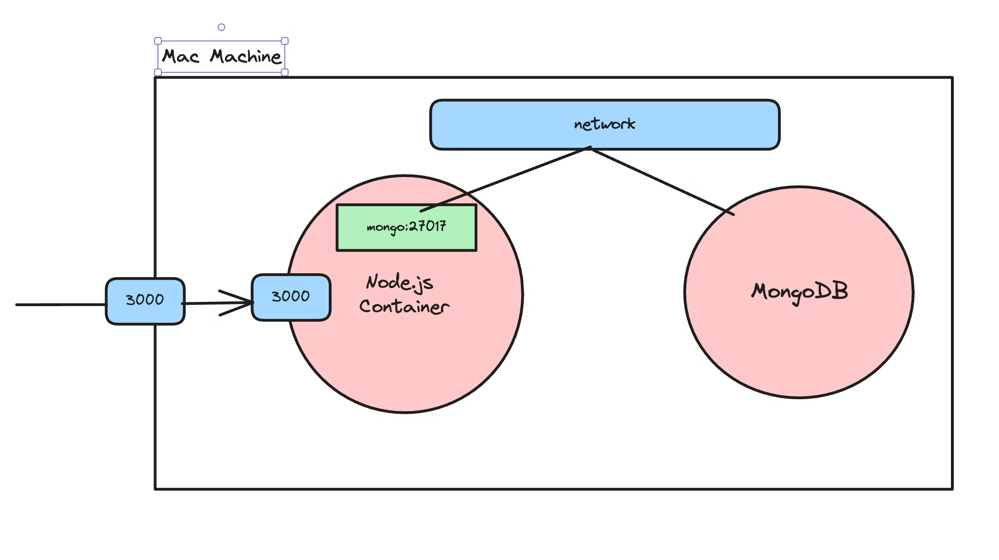
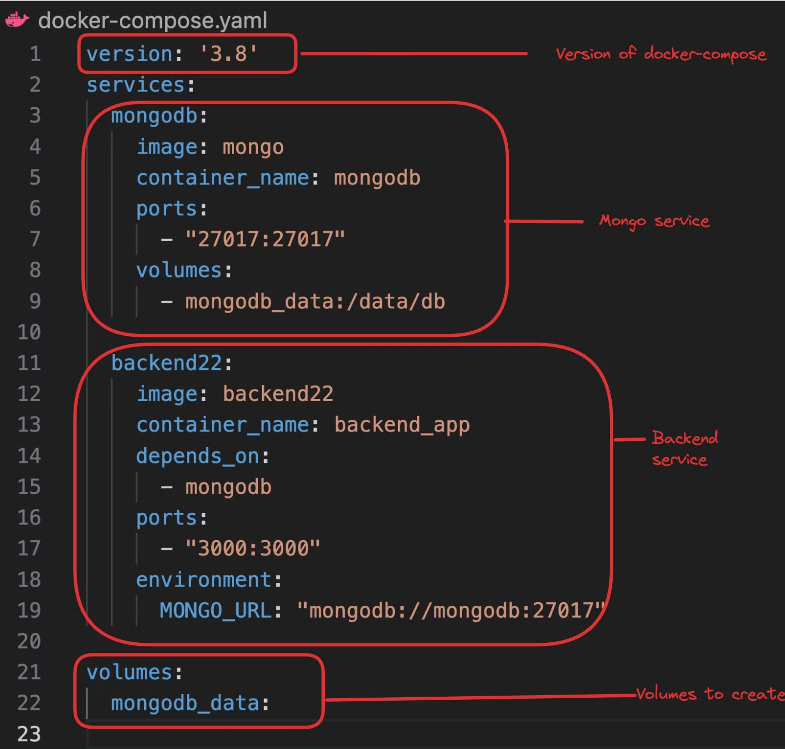
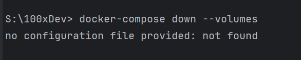
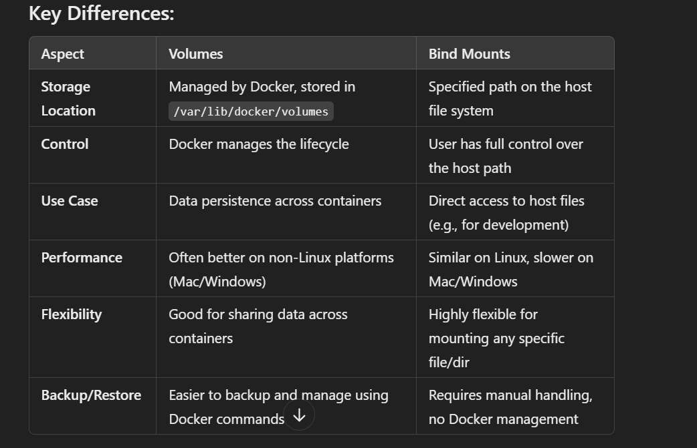

Containers are a way to package and distribute software applications in a way that makes them easy to deploy and run consistently across different environments. They allow you to package an application, along with all its dependencies and libraries, into a single unit that can be run on any machine with a container runtime, such as Docker.

Docker Image
A Docker image is a lightweight, standalone, executable package that includes everything needed to run a piece of software, including the code, a runtime, libraries, environment variables, and config files.
💡
A good mental model for an image is Your codebase on github

Docker Container
A container is a running instance of an image. It encapsulates the application or service and its dependencies, running in an isolated environment.
💡
A good mental model for a container is when you run node index.js on your machine from some source code you got from github

Common docker commands

1. docker images
   Shows you all the images that you have on your machine
2. docker ps
   Shows you all the containers you are running on your machine
3.  docker run
    Lets you start a container
    -p ⇒ let’s you create a port mapping
    -d. ⇒ Let’s you run it in detatched mode (in the background) 
4.  docker build
    Lets you build an image.
5. docker push
   Lets you push your image to a registry (like dockerhub)
6. docker pull
   Lets you pull an image from a registry
7. docker exec
   Lets you run a command inside a running container
8. docker stop
   Lets you stop a running container
9. docker rm
   Lets you remove a container
10. docker rmi
    Lets you remove an image
11. docker logs
    Lets you see the logs of a container
12. docker inspect
    Lets you see the metadata of a container
13. docker kill
    Lets you kill a running container

What is a Dockerfile
If you want to create an image from your own code, that you can push to dockerhub, you need to create a Dockerfile for your application.
A Dockerfile is a text document that contains all the commands a user could call on the command line to create an image.

Step 15 - Layers in Docker
In Docker, layers are a fundamental part of the image architecture that allows Docker to be efficient, fast, and portable. A Docker image is essentially built up from a series of layers, each representing a set of differences from the previous layer.

How layers are made -
Base Layer: The starting point of an image, typically an operating system (OS) like Ubuntu, Alpine, or any other base image specified in a Dockerfile.
Instruction Layers: Each command in a Dockerfile creates a new layer in the image. These include instructions like RUN, COPY, which modify the filesystem by installing packages, copying files from the host to the container, or making other changes. Each of these modifications creates a new layer on top of the base layer.
Reusable & Shareable: Layers are cached and reusable across different images, which makes building and sharing images more efficient. If multiple images are built from the same base image or share common instructions, they can reuse the same layers, reducing storage space and speeding up image downloads and builds.
Immutable: Once a layer is created, it cannot be changed. If a change is made, Docker creates a new layer that captures the difference. This immutability is key to Docker's reliability and performance, as unchanged layers can be shared across images and containers.

If a layer changes, all subsequent layers also changeIf you change your Dockerfile, layers can get re-used based on where the change was made

# Networks and Volumes 
Networks and volumes are concepts that become important when you have multiple containers running in which you
Need to persist data across docker restarts
Need to allow containers to talk to each other

# Docker Compose
Docker Compose is a tool designed to help you define and run multi-container Docker applications. With Compose, you use a YAML file to configure your application's services, networks, and volumes. Then, with a single command, you can create and start all the services from your configuration.

Without docker compose I did this

# Docker Bind Mounts
Bind mounts are a way to persist data across container restarts by mounting a directory from the host machine into the container. This allows you to share files and directories between the host and the container, and any changes made in the container are reflected on the host and vice versa.

In Docker, both volumes and bind mounts allow you to manage data persistence by mounting data from the host into containers, but they differ in how they are managed, stored, and used.

Use Case: Best when you want Docker to manage the lifecycle and location of the data, or when you need to share data across multiple containers easily.
Purpose: Used for persistent and managed storage by Docker.
BM's
Purpose: Used for directly mounting a specific directory or file from the host machine into a container.
Use Case: Best when you need tight control over exactly what data or directories are shared between the host and container (e.g., mounting source code during development).
also for hot-reloads

In general, volumes are recommended when you want Docker to manage the data, while bind mounts are useful when you need more control or want to directly link directories or files from the host system.

