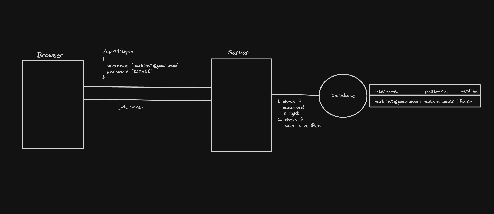
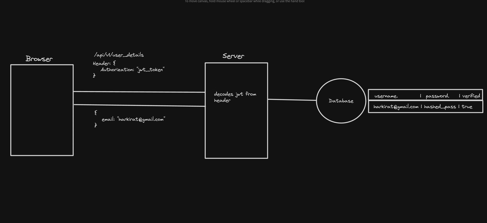
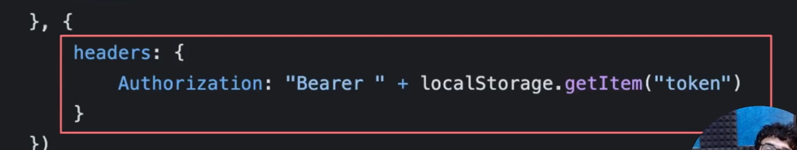
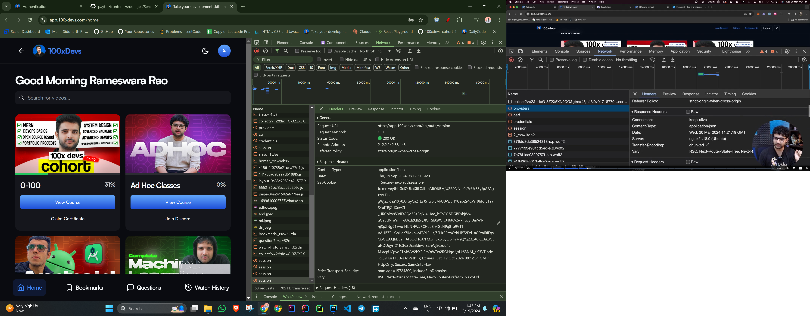
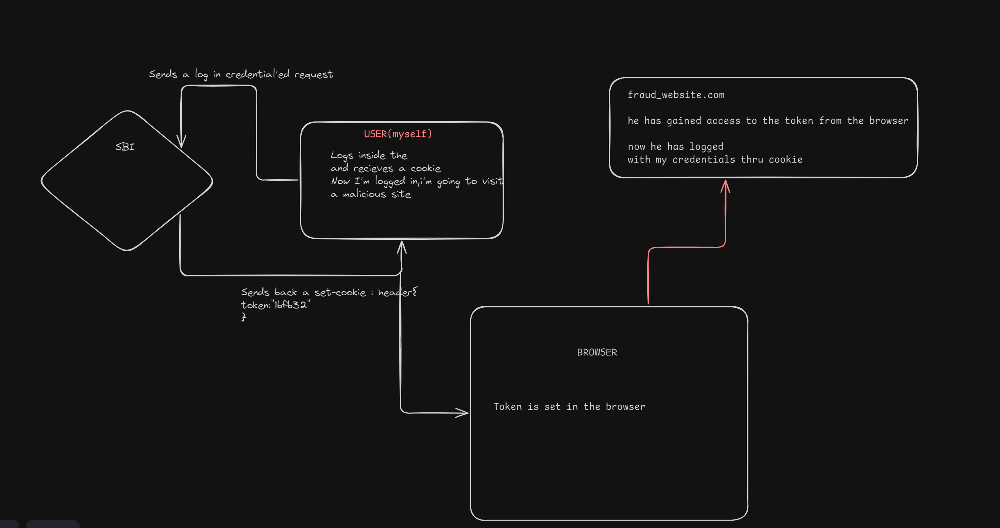
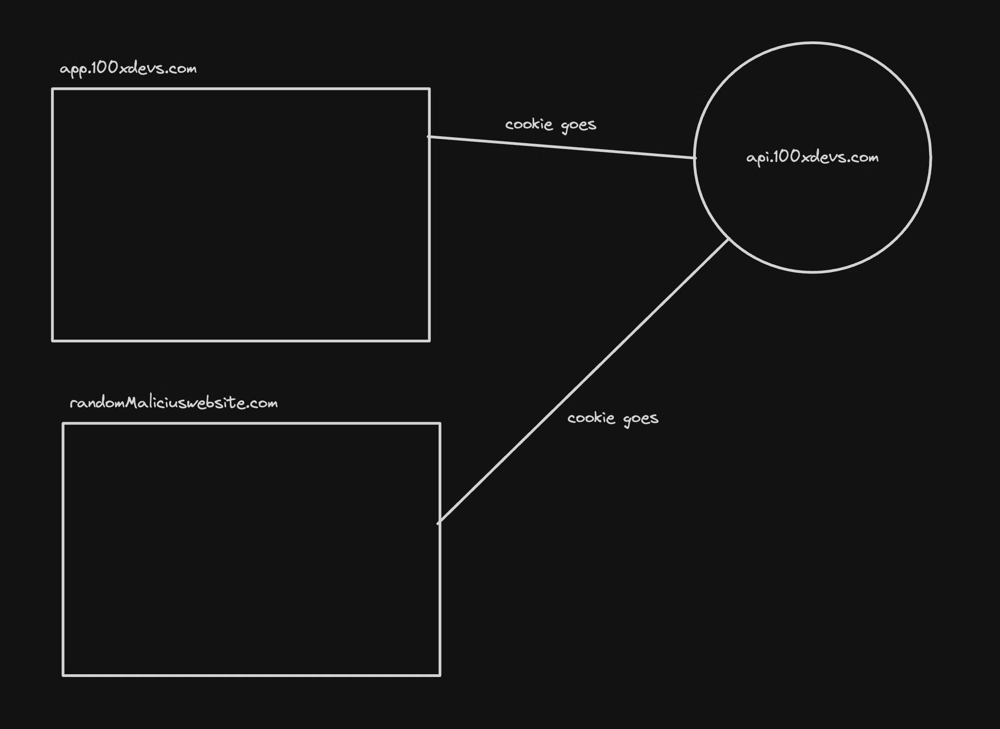
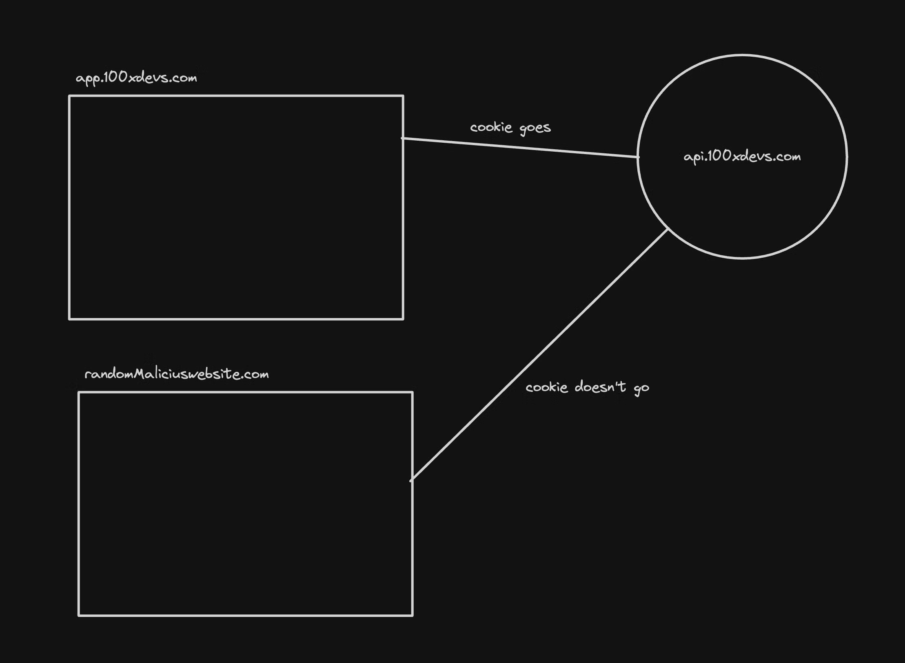
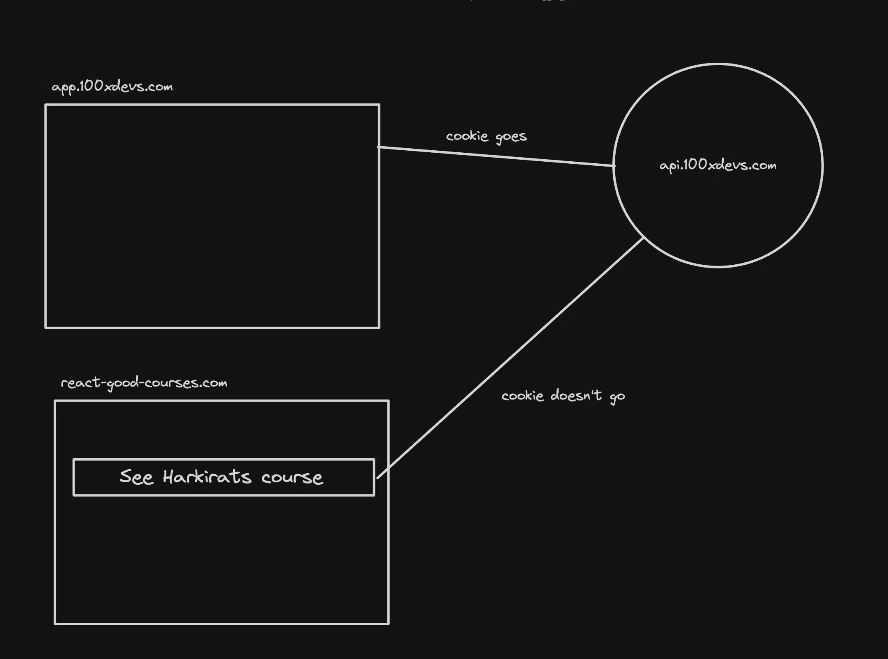
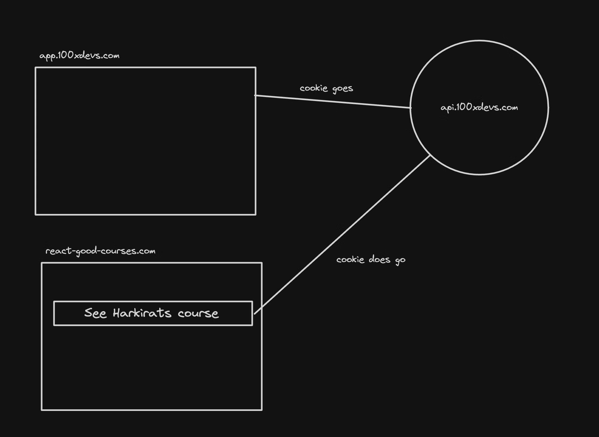

Authentication is the process of letting users signup/signin into websites via username / password or using SSO (single sign on)

Authentication using jwt + localstorage

if a cookie is set on browser , it will be sent with every request to the server. This is how the server knows that the user is authenticated. 
u dont hc =v to keep attaching to the header

# Types of cookies
Persistent - Stay even if u close the window
Session - Go away after the window closes
Secure - Sent only over secure, encrypted connections (HTTPS).

# Properties of cookies
HttpOnly - Can not be accessed by client side scripts
SameSite - Ensures cookies are not send on cross origin requests
Strict
Lax - Only GET requests and on top level navigation
None
Ref - https://portswigger.net/web-security/csrf/bypassing-samesite-restrictions#:~:text=SameSite is a browser security,leaks%2C and some CORS exploits.
Domains - You can also specify what all domains should the cookie be sent from

# CSRF (Cross Site Request Forgery) attacks

to prevent ,make use of
Restrict domains

SameSite=None
What it does: The cookie is sent with all requests, even if they come from another site (cross-site requests).

SameSite=Lax
What it does: Cookies are sent with requests that originate from the same site and with top-level navigation to the site (like when you click a link to visit the site).

SameSite=Strict
   What it does: Cookies are only sent with requests that come from your own website(domain). Even if a user clicks a link from another site to yours, the cookie won’t be sent.

but the problem is

does'nt allow any other than doamin

SameSite without a specified value (default)
What it does: If you don't explicitly set a value for SameSite, many browsers default to Lax. However, this behavior might vary between older and newer browsers.
Lax - It's in strict only but allows evryone to use ,just in top level navigation and  get requests only ,no(post ,put ,delete)

