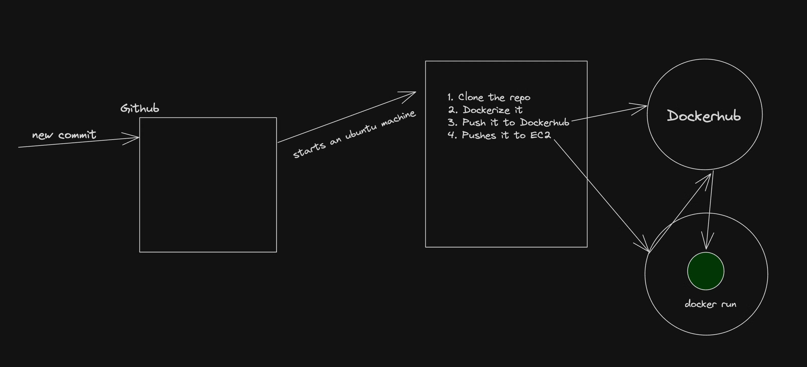
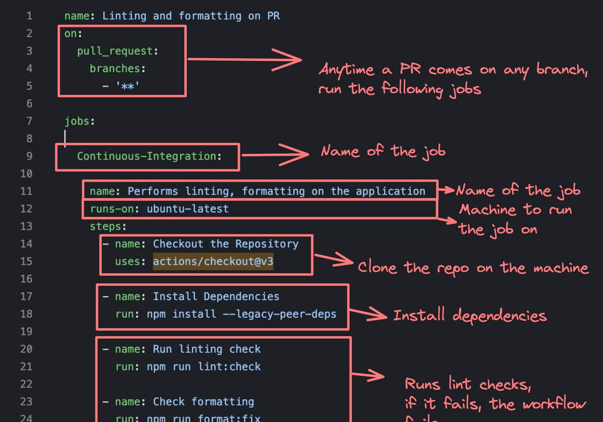

What is CI and CD?
Continuous Integration
Continuous Integration (CI) is a development practice where developers frequently integrate their code changes into a shared repository, preferably several times a day. Each integration is automatically verified by
Building the project and
Running automated tests.
This process allows teams to detect problems early, improve software quality, and reduce the time it takes to validate and release new software updates.
Continuous Deployment
As the name suggests, deploying your code continuously to various environments (dev/stage/prod)

