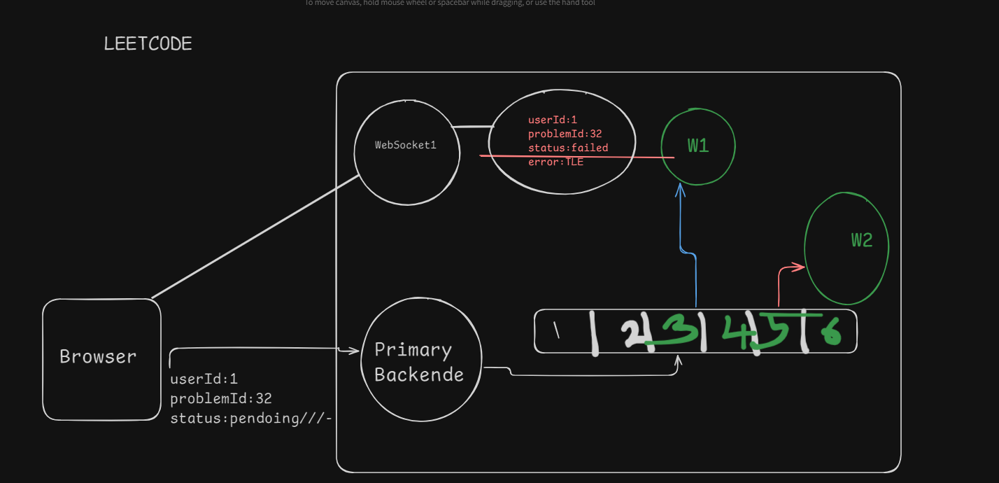
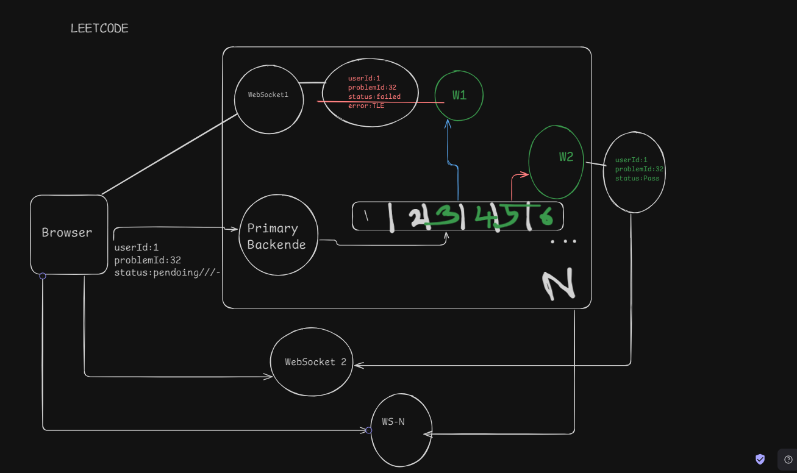
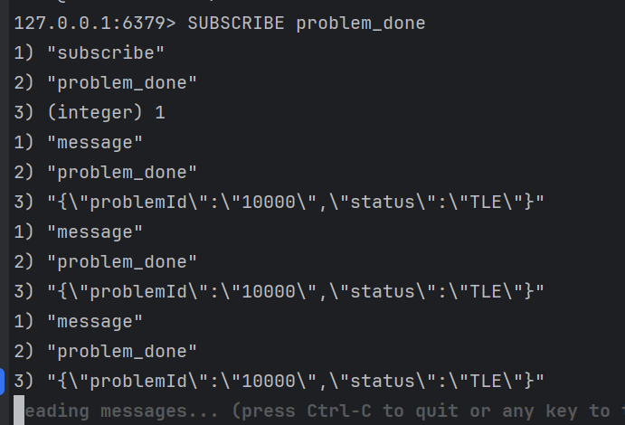
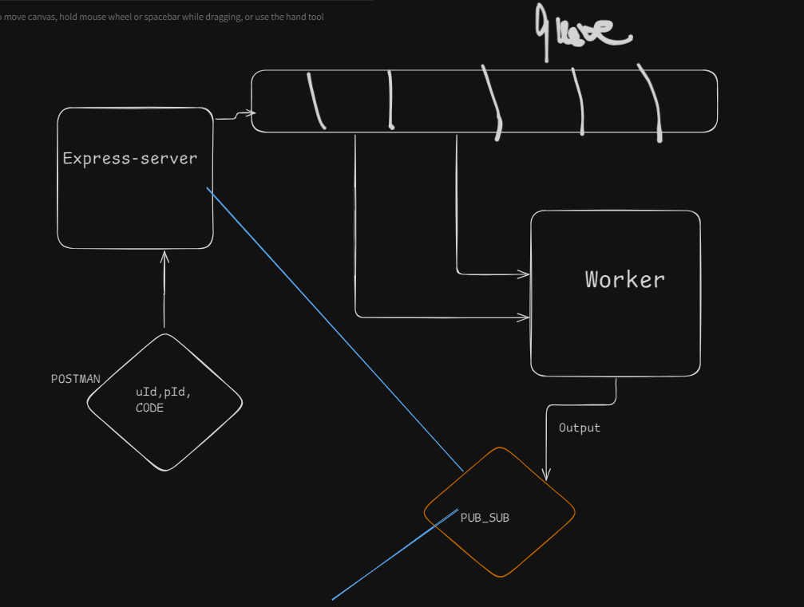
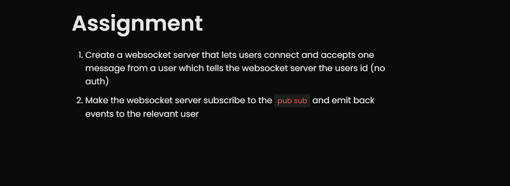
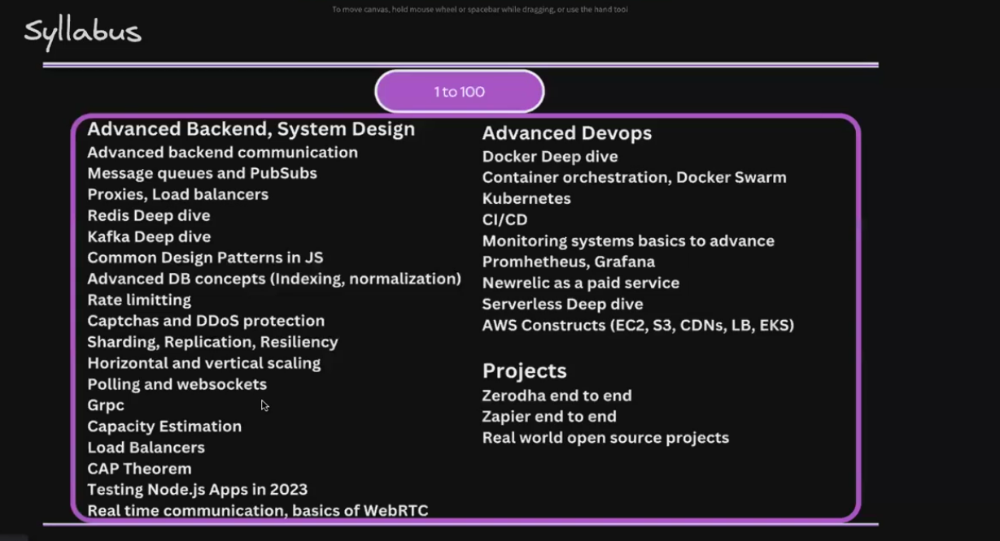

Redis -Pub-Sub

In coding platforms like Codeforces, SUBSCRIBE problem_done is a command or feature used to notify a user when a specific problem has been solved by someone. By subscribing to a problem, you'll receive updates whenever:

A

Syllabus for 1-100
