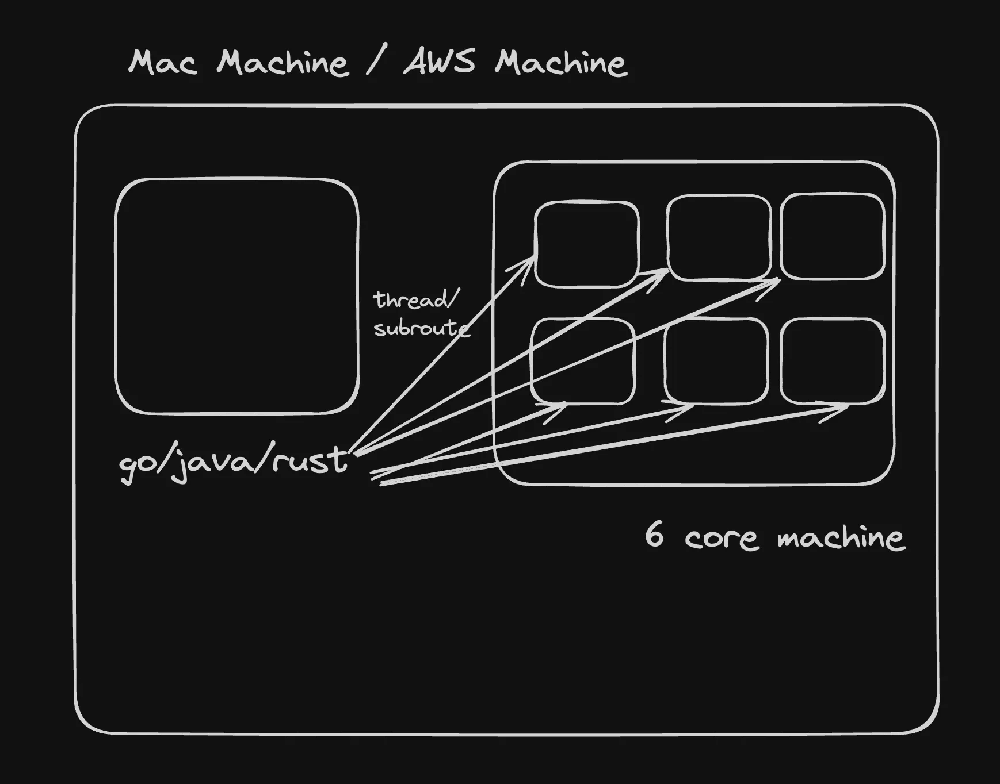
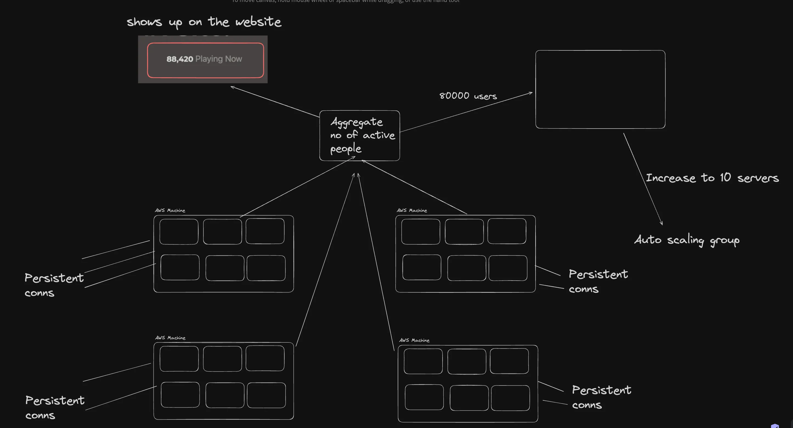
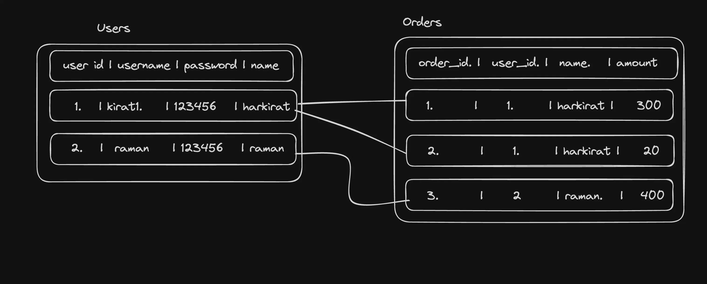
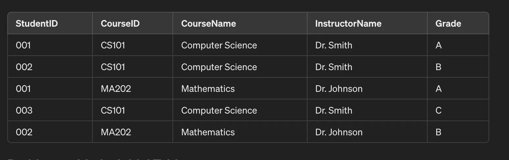
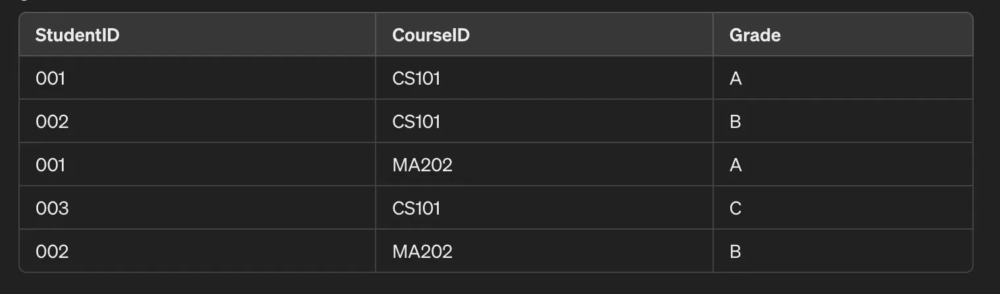
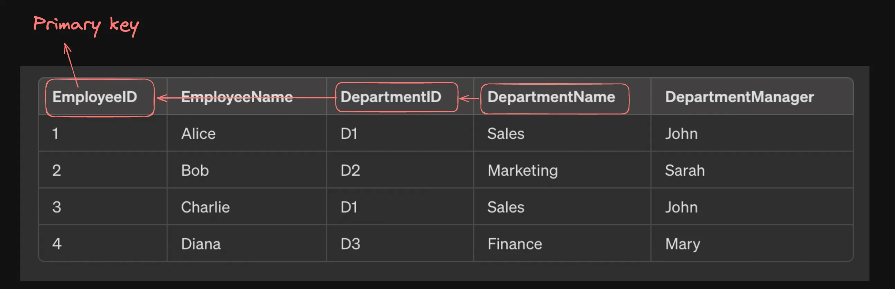
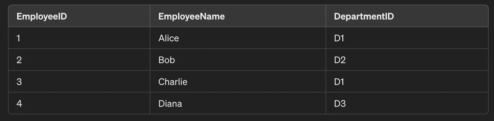
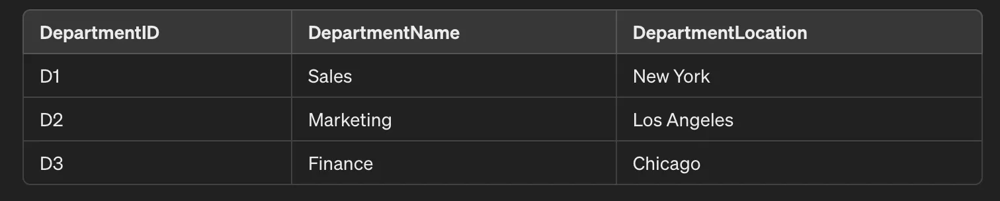
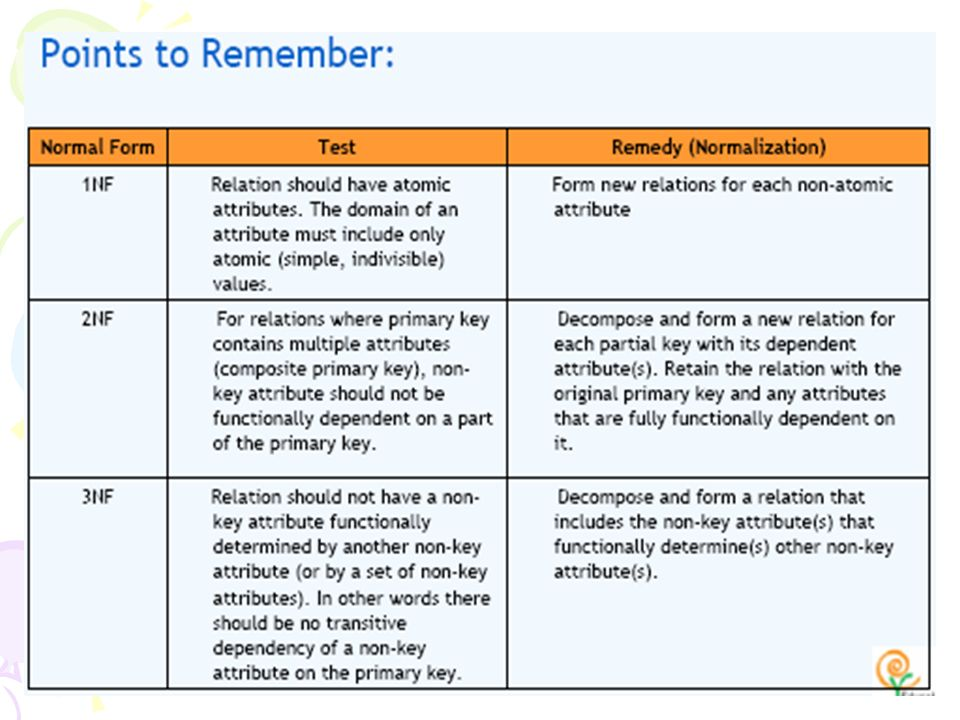

# vertical Scaling and  Horizontal


Vertical scaling
Vertical scaling means increasing the size of your machine to support more load



whereas javascript is single threaded language

Capacity estimation
This is a common system design interview where they’ll ask you
how would you scale your server
how do you handle spikes
How can you support a certain SLA given some traffic

Answer usually requires a bunch of
paper math
Estimating requests/s
Assuming / monitoring how many requests a single machine can handle
Autoscaling machines based on the load that is estimated from time to time





## Horizontal scaling
Horizontal scaling represents increasing the number of instances you have based on a metric to be able to support more load.
AWS has the concept of Auto scaling groups, which as the name suggests lets you autoscale the number of machines based on certain metrics.

``````angular2html

Vertical Scaling (Scaling Up): Vertical scaling refers to adding more resources to a single server or machine, such as increasing CPU, RAM, or storage capacity, to handle more load. It enhances the capabilities of a single system to manage a larger workload.

Horizontal Scaling (Scaling Out): Horizontal scaling involves adding more machines or servers to a system to distribute the load. This method increases the system’s capacity by adding more instances, allowing it to handle more requests or data by spreading the load across multiple devices.
``````

>The Cluster module in Node.js helps in horizontal scaling by enabling the creation of multiple processes that can handle requests concurrently, effectively utilizing the full power of multi-core systems. Here's how it helps:


```angular2html
import express from "express";
import cluster from "cluster";
import os from "os";

const totalCPUs = os.cpus().length;

const port = 3000;

if (cluster.isPrimary) {
  console.log(`Number of CPUs is ${totalCPUs}`);
  console.log(`Primary ${process.pid} is running`);

  // Fork workers.
  for (let i = 0; i < totalCPUs; i++) {
    cluster.fork();
  }

  cluster.on("exit", (worker, code, signal) => {
    console.log(`worker ${worker.process.pid} died`);
    console.log("Let's fork another worker!");
    cluster.fork();
  });
} else {
  const app = express();
  console.log(`Worker ${process.pid} started`);

  app.get("/", (req, res) => {
    res.send("Hello World!");
  });

  app.get("/api/:n", function (req, res) {
    let n = parseInt(req.params.n);
    let count = 0;

    if (n > 5000000000) n = 5000000000;

    for (let i = 0; i <= n; i++) {
      count += i;
    }

    res.send(`Final count is ${count} ${process.pid}`);
  });

  app.listen(port, () => {
    console.log(`App listening on port ${port}`);
  });
}

```


How indexing works (briefly)
When you create an index on a field, a new data structure (usually B-tree) is created that stores the mapping from the index column to the location of the record in the original table.
Search on the index is usually log(n)


# Normalization
Normalization is the process of removing redundancy in your database.

## Redundancy
Redundant data means data that already exists elsewhere and we’re duplicating it in two places
For example, if you have two tables
users
user_metadata
where you do the following - 


Normalisation is done on tables that are full proof (relationships btw tables) to remove redundancy.


# Normalizing data
Normalization in databases is a systematic approach of decomposing tables to eliminate data redundancy and improve data integrity.
The process typically progresses through several normal forms, each building on the last.
When you look at a schema, you can identify if it lies in one of the following categories of normalization

1NF
2NF
3NF
BCNF
4NF
5NF


> You aim to reach 3NF/BCNF usually. The lower you go, the more normalised your table is. But over normalization can lead to excessive joins


## 1NF
A single cell must not hold more than one value (atomicity): This rule ensures that each column of a database table holds only atomic (indivisible) values, and multi-valued attributes are split into separate columns. For example, if a column is meant to store phone numbers, and a person has multiple phone numbers, each number should be in a separate row, not as a list or set in a single cell.

* There must be a primary key for identification: Each table should have a primary key, which is a column (or a set of columns) that uniquely identifies each row in a table
* No duplicated rows: To ensure that the data in the table is organised properly and to uphold the integrity of the data, each row in the table should be unique. This rule works hand-in-hand with the presence of a primary key to prevent duplicate entries which can lead to data anomalies.
* Each column must have only one value for each row in the table: This rule emphasizes that every column must hold only one value per row, and that value should be of the same kind for that column across all rows.

## 2NF
1NF gets rid of repeating rows. 2NF gets rid of redundancy
A table is said to be in 2NF if it meets the following criteria:
is already in 1NF
Has 0 partial dependency.
> 
Partial dependency - This occurs when a non-primary key attribute is dependent on part of a composite primary key, rather than on the whole primary key. In simpler terms, if your table has a primary key made up of multiple columns, a partial dependency exists if an attribute in the table is dependent only on a subset of those columns that form the primary key.
Example: Consider a table with the composite primary key (StudentID, CourseID) and other attributes like InstructorName and CourseName. If CourseName is dependent only on CourseID and not on the complete composite key (StudentID, CourseID), then CourseName has a partial dependency on the primary key. This violates 2NF.

Before normalization

Can you spot the redundancy over here? The instructor name and course name are repeated in rows, even though the name of an instructor should be the same for a given courseID
Primary key of this table is (student_id, course_id)
CourseName and InstructorName have a partial dependency on CourserID

After normalization



## 3NF
When a table is in 2NF, it eliminates repeating groups and redundancy, but it does not eliminate transitive partial dependency.
So, for a table to be in 3NF, it must:
be in 2NF
have no transitive partial dependency.


> A transitive dependency in a relational database occurs when one non-key attribute indirectly depends on the primary key through another non-key attribute.



Department name has a transitive dependency on the primary key (employee id).

After normalaization





Partial dependency occurs when a non-prime attribute is dependent on only part of a composite primary key, rather than the entire key, leading to redundancy and violating the Second Normal Form (2NF). Transitive dependency happens when a non-prime attribute depends on another non-prime attribute that, in turn, depends on the primary key, violating the Third Normal Form (3NF). While partial dependency involves direct reliance on a part of the composite key, transitive dependency involves an indirect relationship through another attribute. Both types of dependencies lead to anomalies and are resolved by normalization to ensure database efficiency and integrity.



diff btw partial and transitive deps -> https://youtu.be/q4DOysW1XEs


