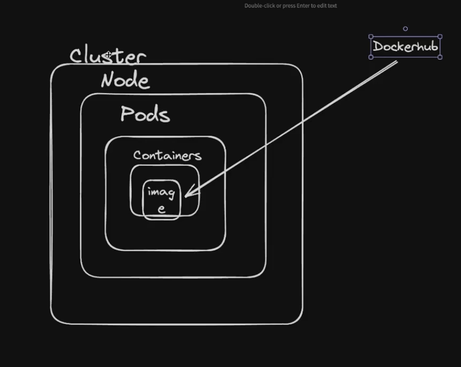
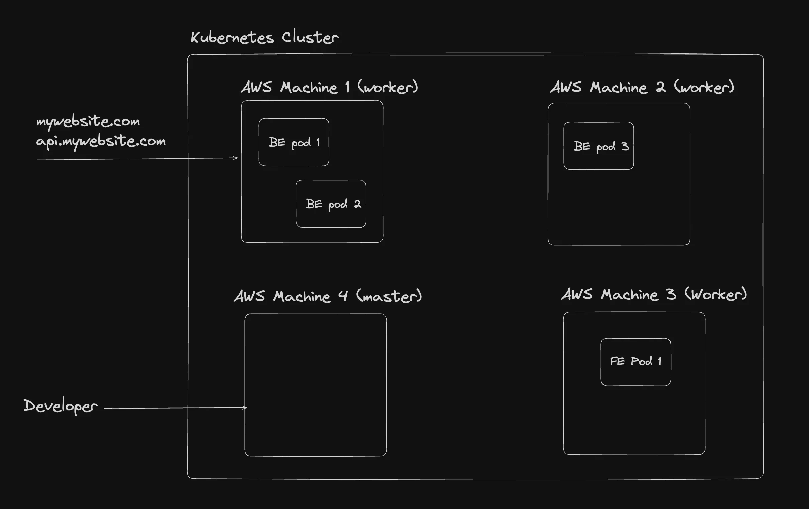
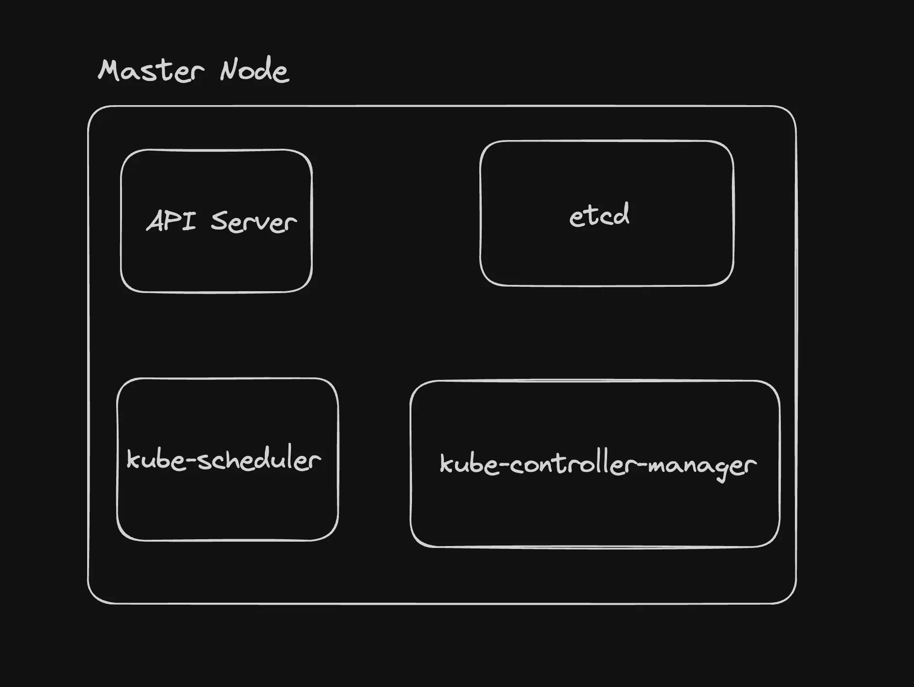
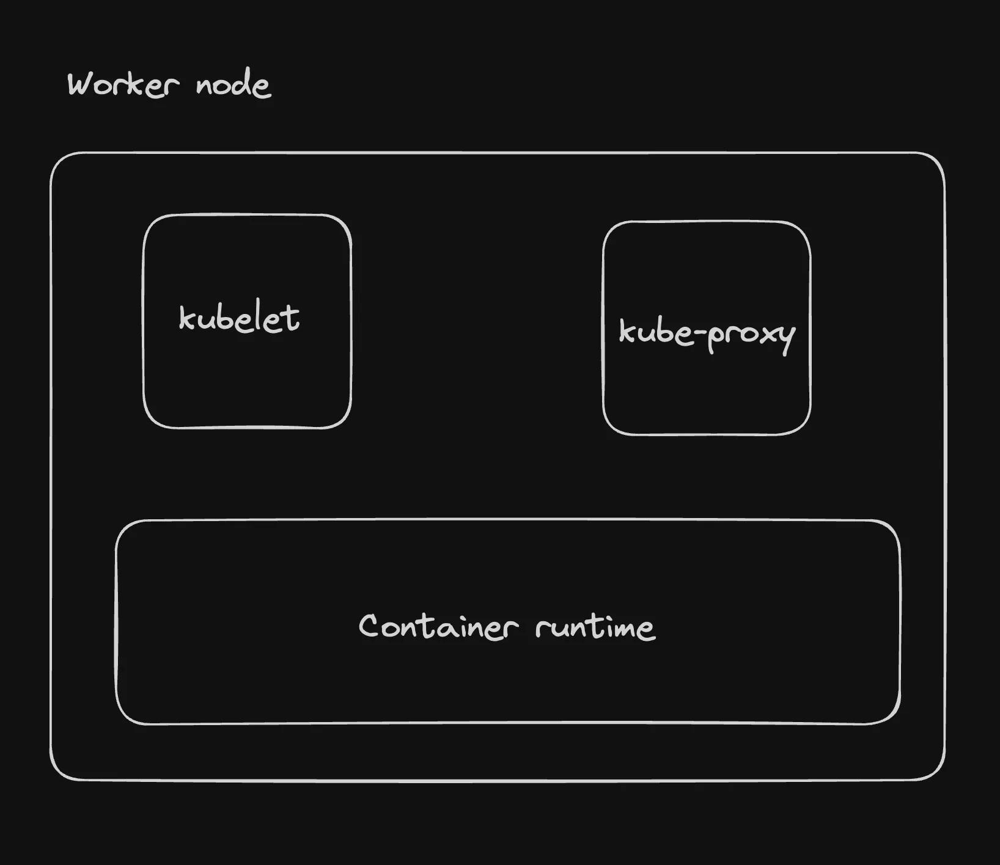
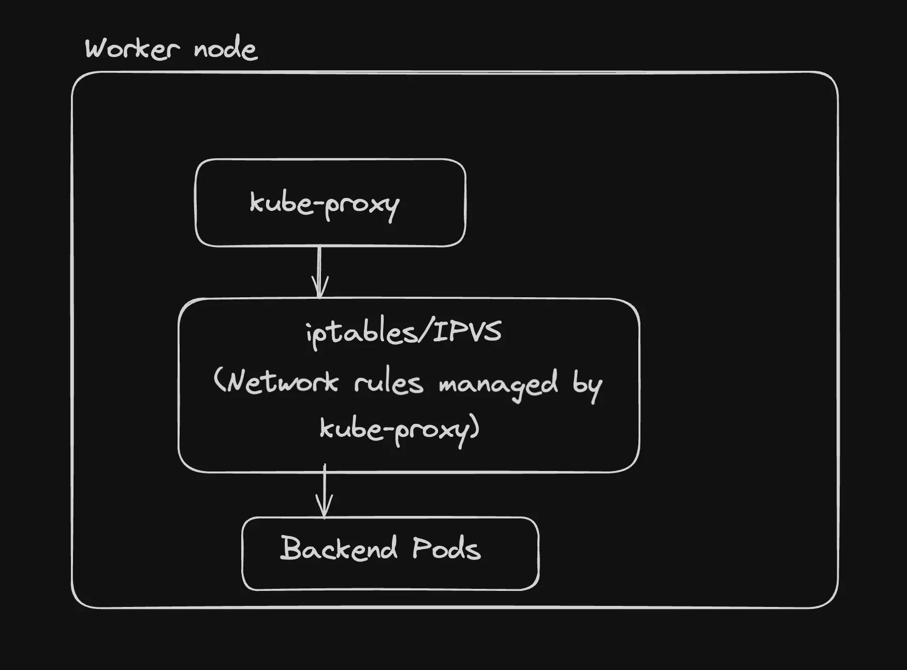

Developer intracts inside the cluseter and says master node/pod to start  ,  and where the pod/node starts is the worker nodes

All of the machine which run k8 are nodes here

there are 2 types of nodes

## master node - > 
The node that takes care of deploying the containers/healing them/listening to the developer to understand what to deploy

1. API Server

* handles REST API => These requests involve creating, reading, updating, and deleting Kubernetes resources such as pods, services, and deployments
* Authentication and Authorization: who can get into the cluster
* Metrics and Health Checks: Monitoring
* Communication Hub:Other components, such as the scheduler, controller manager, and kubelet, interact with the API server to retrieve or update the state of the cluster.

2. etcd 

Consistent and highly-available key value store used as Kubernetes' backing store for all cluster data. Ref -

3. kube-scheduler
   The kube-controller-manager is a component of the Kubernetes control plane that runs a set of controllers. Each controller is responsible for managing a specific aspect of the cluster's state.
   There are many different types of controllers. Some examples of them are:
   Node controller: Responsible for noticing and responding when nodes go down.
   Deployment controller:  Watches for newly created or updated deployments and manages the creation and updating of ReplicaSets based on the deployment specifications. It ensures that the desired state of the deployment is maintained by creating or scaling ReplicaSets as needed.
   ReplicaSet Controller: Watches for newly created or updated ReplicaSets and ensures that the desired number of pod replicas are running at any given time. It creates or deletes pods as necessary to maintain the specified number of replicas in the ReplicaSet's configuration.

## worker node ->
The nodes that actually run your Backend/frontend

1. kubelet - An agent that runs on each node in the cluster. It makes sure that containers are running in a Pod.
2. kube-proxy  - The kube-proxy is a network proxy that runs on each node in a Kubernetes cluster. It is responsible for you being able to talk to a pod

3. Container runtime - In a Kubernetes worker node, the container runtime is the software responsible for running containers.

# Cluster
A bunch of worker nodes + master nodes make up your kubernetes cluster . You can always add more / remove nodes from a cluster.

