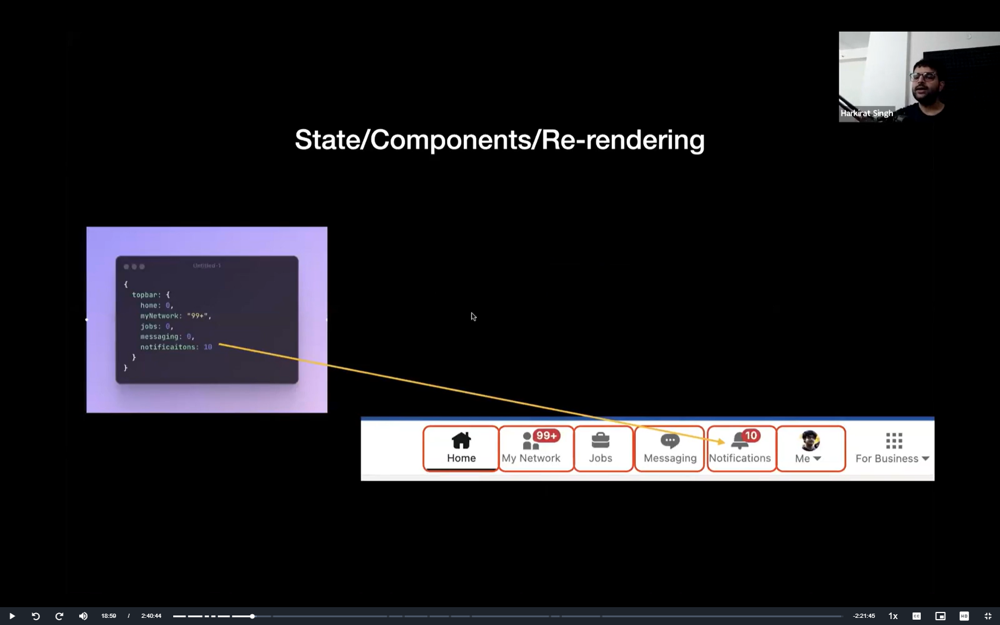

* we have to take care of three things when we are creating a react application
* components
* state
* re-rendering

Creators of frontend frameworks realised that every websites can be divided into two parts
state and components

state : - A javascript object that represents the current state of the application,the dynamic things 
Any thing that changes ,we need state

component - : how a DOM element should render ,given a state

components render the state and puts the count(for example) in the notification areana
<a HTML snippet> basically

Re-renders - It takes the current state and puts it into the component,basically it changes the DOM element

A state change triggers a re-render . A re-render represents an actual DOM being manipulated when the state is changed

React is an easier way to write HTML/CSS

