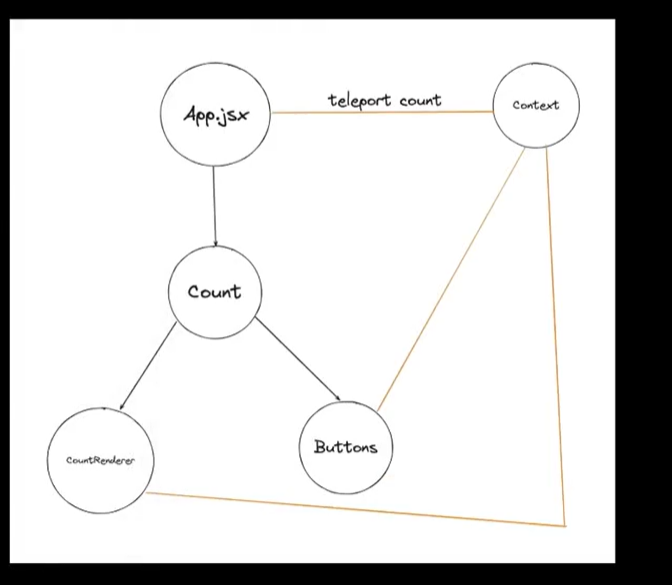
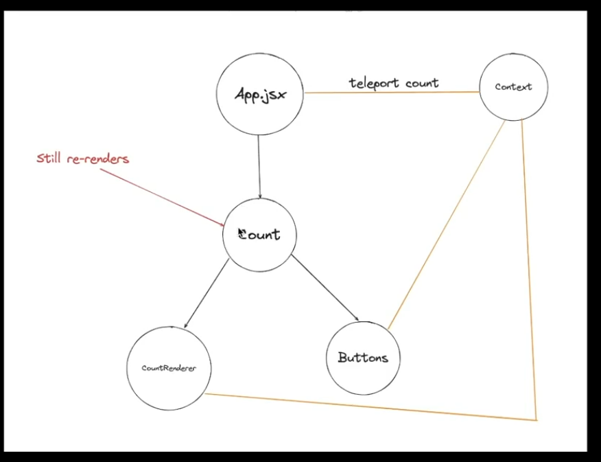

Suspense API -> async data and component fetching

Passing Data Deeply with Context
Usually, you will pass information from a parent component to a child component via props. But passing props can become verbose and inconvenient if you have to pass them through many components in the middle, or if many components in your app need the same information. Context lets the parent component make some information available to any component in the tree below it—no matter how deep—without passing it explicitly through props.

