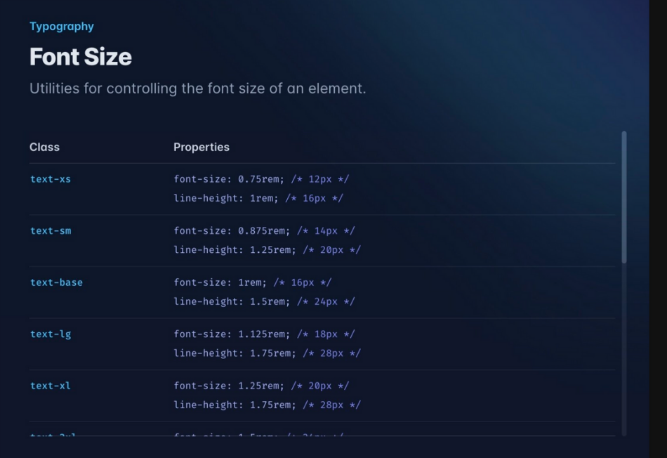
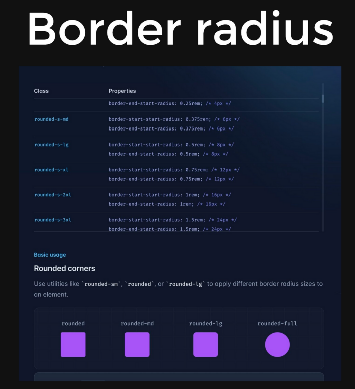
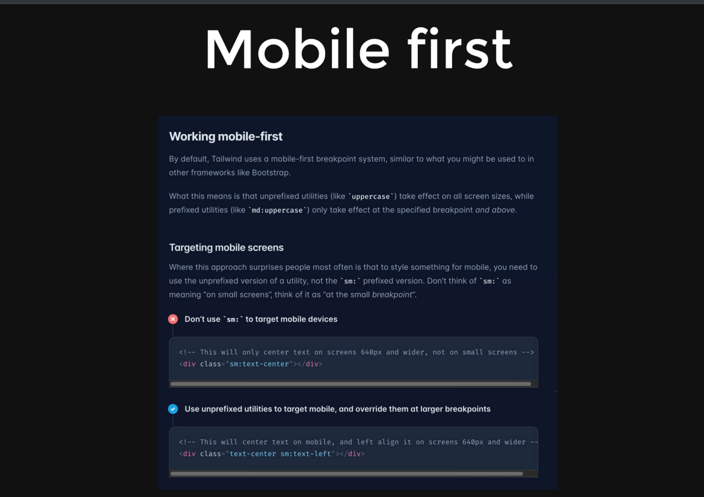

# Tailwind 
Things to know in  a frontend framework
* flex
* Grids
* Responsive design
* background color,text color,hover


_Flex_ - they all coe in  a staright line







# Paytm building
CORS is a node.js package for providing a Connect/Express middleware that can be used to enable CORS with various options.

Many of us that have been using the Node/Express Framework have been used to installing another piece of middleware in order for us to be able to read the “body” of an incoming JSON object. This piece of middleware was called body-parser and used to not be part of the Express framework. The good news is that as of Express version 4.16+, their own body-parser implementation is now included in the default Express package so there is no need for you to download another dependency.

npm install --save body-parser or app.use(express.json()); //Used to parse JSON bodies

Zod is a TypeScript-first schema declaration and validation library that is used for defining and validating the shape of objects, arrays, and other data types. Here's why you might need Zod:
```angular2html
signinBody.safeParse(req.body):

signinBody is probably a Zod schema object that defines the expected structure and validation rules for the request body (req.body).

lastName: zod.string().optional(),
.email()
```


safeParse returns an object containing two properties:
success: A boolean that indicates whether the parsing/validation was successful.
data: The parsed data, only available if success is true.
error: The error details, only available if success is false.